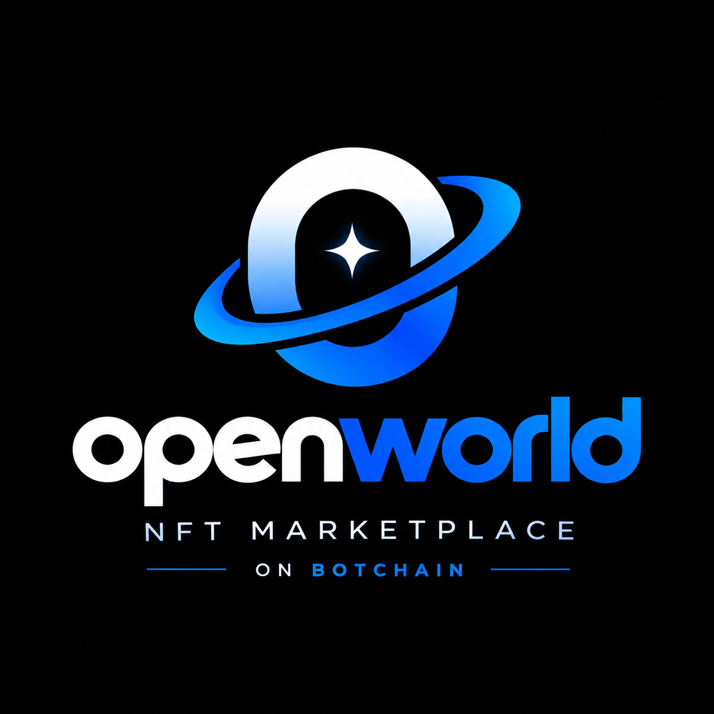

# OpenWorld — Botchain NFT Protocol & Marketplace

<div align="center">
  
  <h3>High-Performance Institutional NFT Marketplace & Launchpad</h3>
  <p>Built specifically for <strong>Botchain Testnet (Chain ID: 968)</strong></p>
</div>

---

## 🌐 Network Configuration (Botchain Testnet)

| Parameter | Value |
| :--- | :--- |
| **Network Name** | Botchain Testnet |
| **Chain ID** | `968` |
| **RPC Endpoint** | `https://rpc.bohr.life` |
| **Native Token** | `BOT` |
| **Total Supply** | 150 Million BOT |
| **Block Explorer** | [https://scan.bohr.life](https://scan.bohr.life) |

---

## 📜 Deployed Smart Contracts

| Contract | Address | BohrScan Explorer |
| :--- | :--- | :--- |
| **OpenWorldNFT (Genesis Collection)** | `0x50Eda285Fdc45AE741eF4F23110E9BE4a3CFec61` | [View on BohrScan](https://scan.bohr.life/address/0x50Eda285Fdc45AE741eF4F23110E9BE4a3CFec61) |
| **OpenWorldMarketplace** | `0x526676Bed606B8942dd1Eb18b7E6090E14C5a30A` | [View on BohrScan](https://scan.bohr.life/address/0x526676Bed606B8942dd1Eb18b7E6090E14C5a30A) |

*Flattened Solidity files for 1-click explorer verification are available in [`contracts/flattened/`](contracts/flattened/).*

---

## ✨ Core Features & Parity

### 1. 🎨 OpenSea-Grade Mint Studio (`/create`)
- **100% Fully On-Chain Storage**: Encodes image data and metadata directly into Base64 Data URIs stored inside the Botchain contract state mapping. Zero external image hosting / S3 / IPFS pinning dependencies required.
- **Uncapped Supply Minting**: Single items (`1 of 1`) or batch editions (`N items`) minted directly in one transaction flow.
- **Owner-Only Unlockable Content**: Creators can embed private redemption codes, Discord access keys, or high-res download URLs visible only to the verified on-chain owner.
- **External Project Links**: Embed official project or portfolio links directly in token metadata.
- **EIP-2981 Creator Royalties**: Selectable royalty fee percentage (0% to 10%) enforced on all secondary marketplace trades.

### 2. ⚡ Institutional Trading Terminal (`/` & `/nft/[contract]/[tokenId]`)
- **Zero Mock Data**: 100% live queries via pure JSON-RPC directly to Botchain Testnet smart contracts.
- **Real-Time Market Stats**: Floor price, volume, active listing counters, and layout toggle (Grid / Table view).
- **Direct On-Chain Trading**: Fixed-price listings and instant purchases in native `BOT` with automatic royalty and protocol fee distribution (1.5% fee).
- **Escrowed Offer Engine**: Place and cancel escrowed bids with BOT locked safely in the contract until accepted or withdrawn.
- **Direct Transfer Modal (`safeTransferFrom`)**: Send NFTs directly to any Botchain address with real-time address validation.
- **Social Sharing**: 1-click Share to X (Twitter) and instant copy-to-clipboard link sharing.

### 3. 📊 Activity & Portfolio Hub (`/activity` & `/profile`)
- **Live Event Ledger**: Real-time event log indexing `ItemListed`, `ItemBought`, `ItemCancelled`, and `OfferCreated`.
- **Portfolio Viewer**: Real-time BOT balance, owned NFTs, and active listed items.

---

## 📁 Repository Structure

```
openworld/
├── contracts/                  # Smart contract suite (Hardhat)
│   ├── contracts/
│   │   ├── OpenWorldNFT.sol    # ERC721 + EIP-2981 royalties + batch minting
│   │   └── OpenWorldMarketplace.sol # Listings, purchases, escrow offers, fees
│   ├── flattened/              # Verified single-file Solidity contracts
│   ├── scripts/                # Deploy & seed scripts
│   ├── test/                   # Automated contract test suite
│   └── hardhat.config.js       # Botchain Testnet & Etherscan verify config
│
└── frontend/                   # Web3 DApp frontend (Next.js 16 + Turbopack)
    ├── src/
    │   ├── app/                # Next.js App Router (Marketplace, Detail, Studio, Activity, Portfolio)
    │   ├── components/         # Modals (Buy, List, Offer, Transfer), Navbar, Cards
    │   ├── config/             # Wagmi & Reown AppKit configuration, contract ABIs
    │   ├── context/            # Web3 React Query & Wagmi context provider
    │   ├── hooks/              # Custom reactive on-chain hooks
    │   └── services/           # Viem JSON-RPC direct chain reader & metadata decoder
    └── public/                 # Branding assets & logo
```

---

## 🚀 Quick Start Guide

### Prerequisites
- Node.js `>= 18.x`
- npm or pnpm
- MetaMask or any EVM Web3 wallet configured with Botchain Testnet

---

### 1. Smart Contracts Setup

```bash
cd contracts

# Install dependencies
npm install

# Run automated test suite
npx hardhat test

# Deploy to Botchain Testnet (requires PRIVATE_KEY in .env)
npx hardhat run scripts/deploy.js --network botchainTestnet

# Seed initial on-chain NFTs
npx hardhat run scripts/seedOnchain.js --network botchainTestnet
```

---

### 2. Frontend Setup

```bash
cd frontend

# Install dependencies
npm install

# Start local development server (runs on port 3000)
npm run dev

# Build for production
npm run build
```

Open [http://localhost:3000](http://localhost:3000) in your browser.

---

## 🔒 Security & Standards

- **ERC-721**: Standard non-fungible token implementation.
- **EIP-2981**: Standard royalty distribution on secondary sales.
- **ReentrancyGuard**: OpenZeppelin reentrancy protection on marketplace funds and escrow transfers.
- **Ownable**: Secure access control for fee management.

---

## 📄 License
MIT License.
